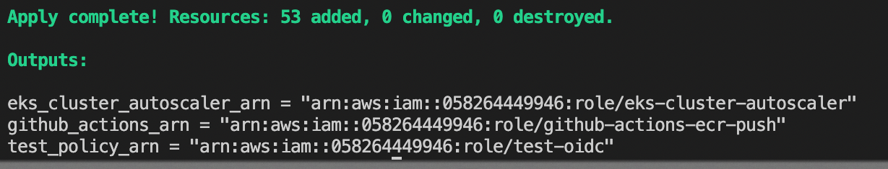
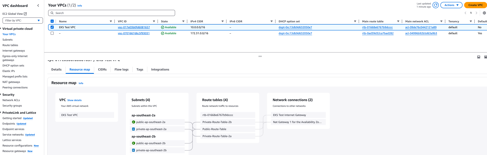
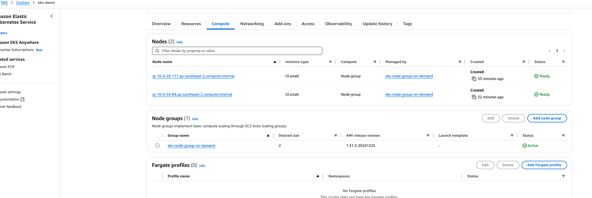
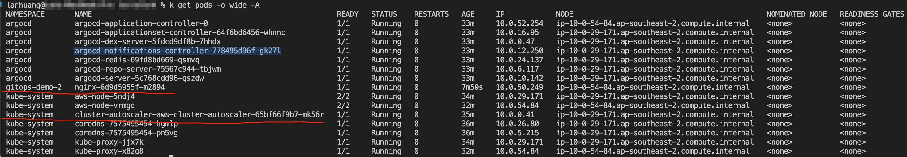
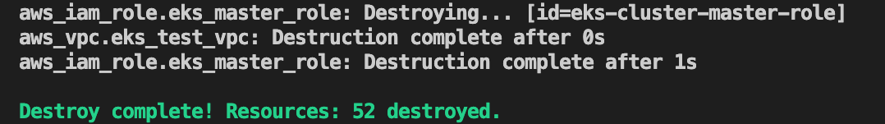

# create-an-eks-cluster-using-terraform

This repo is used to 

## References

## The technical services I used

* AWS: EC2,VPC,IAM,EKS,and ECR.
* Terraform
* Argocd auto sync policy
* Github actions

## The architecture diagram

## Prerequisites

* Create a new aws account
* Create an IAM user in the new aws account created above with the details below.
  * User Name: `Administrator`
  * Custom password: Create your own password
  * Attach policies directly with the policy name called `AdministratorAccess`
* A locally configured AWS profile for the above IAM user `Administrator`
* All the AWS resources mentioined above are created in the IAM user account `Administrator`
* Install Terraform
* Install AWS CLI
* Install colima to run docker as I'm on Mac (m2 chip)
* Install kubectl
* Install argocd CLI
* Install jq

## Use Terraform to bootstrap both AWS resources and argocd

### Initialise the TF directory

```terraform
 terraform init

```

### Create an execution plan

```terraform
 terraform plan
 
```

### Execute terraform configuration

It takes around 15-20 mins to bootstrap all resources.

```terraform
 terraform apply --auto-approve
 
```



### Verification steps

#### VPC verification



#### EC2 verification


#### EKS verification



#### CI part verification


#### CD part verification


#### Kubectl to retrieve all pods

It shows that the pod `my-nginx`  has been deployed in the namespace `gitops-demo-2` and another pod `cluster-autoscaler` which is used to scale up pods has been deployed in the namespace `kube-system`



### Cleanup resources

This needs to be improved in future. Currently, some manual steps below are required before running `terraform destroy`.

* Manually delete the argo app in the argocd UI.
* Manually run `kubectl delete ns argocd` so that `terraform destroy` wont get stuck in destroying the eks worker nodes. 
* Manully remove all images in the ECR repo. Otherwise it wont allow the ecr repo to be deleted by Terraform.

```terraform
 terraform destroy
 
```

Please note one resource `argocd` has been manually deleted via kubectl commands, so the total number has been changed from 53 to 52.



### Misc

#### Requirements

| Name          | Version       |
| ------------- |:-------------:|
| terraform     | >= 1.0        |
| aws           | >= 4.50.0     |

#### Providers

| Name          | Version       |
| ------------- |:-------------:|
| aws           | >= 4.50.0     |