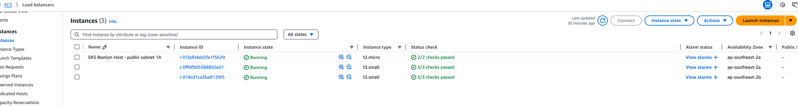

# create-an-eks-cluster-using-terraform

This repo is used to introduce how to deploy a containerized application to AWS Elastic Kubernetes Service (EKS) with ArgoCD, GitHub Actions, and Terraform.
The entire lifecyle is achieved by a fully automated CI/CD process.

## The technologies I used

* Html
* Docker
* Kubernetes
* AWS resources including EC2,VPC,IAM,EKS,and ECR.
* Shell script
* Argo CD including Argo CD UI, Argo CD CLI and auto sync policy.
* Terraform
* GitHub Actions

## The repos involved

* The [application repo](https://github.com/jhuang2019/my-nginx) which includes `Dockerfile`
* The [GitOps repo](https://github.com/jhuang2019/gitops-apps/tree/main/simple-app) which includes Kubernetes manifests
* This [infrascture code repo](https://github.com/jhuang2019/create-an-eks-cluster-using-terraform) which includes Terraform code

## The architecture diagram


* The continuous integration(CI) includes the following steps:
  * Developers merge code to the main branch of the applicatio repo which includes a `Dockerfile`.
  * GitHub Actions webhook is triggered automatically due to the new code merge and a new build is started.
  * A new docker image is built with a new image tag.  I took `github.sha` as the new docker image tag.
  * The new docker image is pushed to Amazon ECR.
  * The Kubernetes deployment manifest file called `deployment.yml` in the GitOps repo is also updated with the new image tag.
  
* The continuous deployment(CD) process includes the following step:
  * Argo CD will automatically synchronize the change in the `depoyment.yml` and deploy it to Amazon EKS.
 
* The entrie infrastructre including all aws resoures and Argo CD is created by Terraform.

## Prerequisites

* Create a new aws account
* Create an IAM user in the new aws account created above with the details below.
  * User Name: `Administrator`
  * Custom password: Create your own password
  * Attach policies directly with the policy name called `AdministratorAccess`
* A locally configured AWS profile for the above IAM user `Administrator`
* All the AWS resources mentioined above are created in the IAM user account `Administrator`
* Install Terraform
* Install AWS CLI
* Install colima to run docker as I'm on Mac (m2 chip)
* Install kubectl
* Install argocd CLI
* Install jq

## Steps to implement the CI and CD process

### Step 1: Containerizing the Application with Docker
  
#### The application repo is saved in an individual repo called `my-nginx`. The link is  https://github.com/jhuang2019/my-nginx

* Create a file called `index.html` which includes some basic html tags below.

```html
<html>
<head>
    <title> Deploy My First Application in Kubernetes</title>
</head>    
<body>
    <hearder>
        <h1>Welcome to My First Kubernetes Deployment</h1>
    </hearder>
    <nav>
        <ul>
            <li><a href="#">Home</a></li>
            <li><a href="#">About</a></li>
            <li><a href="#">Service</a></li>
            <li><a href="#">Contact</a></li>
        </ul>
    </nav>
</body>
</html>

```

* Create a `Dockerfile` which contains the following code.

```docker
FROM --platform=linux/amd64 nginx:latest

COPY index.html /usr/share/nginx/html

EXPOSE 80

CMD ["nginx","-g","daemon off;"]

```

#### The brief overview of what this Dockerfile does is below:

* Base image: It uses the official nginx:latest image as the foundation. I had to add `--platform=linux/amd64` as I got an error `exec /docker-entrypoint.sh: exec format error` when deploying my app to EKS. The root cause is that the image I genereated on my Mac with M2 chip is not compatible with Amazon EKS. So I had to use `--platform=linux/amd64` in order to tell Docker to specifically build for linux/amd64 when it is generating the image, so my docker image that is being built on MacOS will be compatible and deployable to Amazon EKS.
* Copy index.html file: Copies index.html from my host machine into the container default nginx directory `/usr/share/nginx/html`.
* Expose port 80: This allows access to the app via port 80 from outside the container.
* The `CMD` instruction: It specifies the default command to run when a container is started from the Docker image.The `-g 'daemon off;'` option is used to start the Nginx server in the foreground instead of as a background process when the container starts.

### Step 2: Writing Kubernetes Manifests for Your Application

In this step, we will write Kubernetes manifests to deploy our application. The Kubernetes manifests are saved in another individual repo for GitOps called `gitops-apps`.  We will create two files below. The link is https://github.com/jhuang2019/gitops-apps/tree/main/simple-app.

* `deployment.yml`:  for running the Docker image
* `service.yml`: for exposing the application that is running as one or more Pods in the Amazo EKS. The service is exposed externally using an external load balancer which will be created in AWS.

In AWS, open Amazon Elastic Container Registery (ECR) and manually create a private repo called `jen/my-nginx`to maintain docker images. Copy the entire path to `deployment.yml`, and give a dummy tag `xxxxxxxxyyyy` as the image tag. Once the `deployment.yml` is updated, please delete the private repo in ECR as Terraform code will bootstrap the ECR repo automatically.

``` k8s
apiVersion: apps/v1
kind: Deployment
metadata:
  namespace: gitops-demo-2
  name: nginx
spec:
  replicas: 1
  selector:
    matchLabels:
      app: nginx
  template:
    metadata:
      labels:
        app: nginx
    spec:
      containers:
      - name: nginx
        image: <my-ecr-path>.<my aws region>.amazonaws.com/jen/my-nginx:xxxxxxxxyyyy

```

### Step 3: Implementing Infrastructure as Code with Terraform

Below is an outline of the project directory


* `.gitignore`
* `README.md`
* `k8s` folder: This folder is optional to bootstrap all aws resources as it is used to learn cluster-autoscaler. It includes two Kubernetes manifests below. 
  * `aws-test.yaml`: This is used to manually test the oidc provider and iam role which are implemented in `terraform/9-iam-oidc.tf` and `terraform/10-iam-test.tf`
  * `cluster-autoscaler.yaml`: This is used to deploy cluster-autosclaer to the namespace `kube-system` manually. The iam role is implemented in `terraform/11-iam-autoscaler.tf`
* `terraform` folder: This folder contains the terraform code to bootstrap all aws resources and argocd. The `terraform state file` is stored locally to save cost.
  * `0-provier.tf`: It is used to set up Terraform to interact with AWS and other cloud providers.  
  * `1-vpc.tf`: It is used to set up our own VPC.
  * `2-igw.tf`: To provide internet access for our services, we need to have an internet gateway in our VPC. We also need to attach it to the VPC that we just created above.
  * `3-subnets.tf`: It defines two public subnets and two private subnets for our own VPC.
  * `4-nat.tf`: It is used to create a NAT Gateway which is used in private subnets to allow services to connect to the internet. For NAT, we need to allocate public IP address first and to place it in the public subnet.
  * `5-routes.tf`: It is used to  create routing tables and associate subnets with the VPC, internet gateway and NAT gateway created above.
  * `6-iam.tf`: It contains the IAM roles which are required for EKS and the EKS worker node group.
  * `7-eks-cluster.tf`: It is used to set up the EKS cluster.
  * `8-eks-node-group.tf`: It is used to set up a single instance group for Kubernetes. The single instance group is part of a ASG and its minimum size is 1 and the masimum size is 2.
  * `9-iam-oidc-tf` and `10-iam-test.tf`: They are optional as they are used for `k8s/aws-test.yaml` which is used to test the oidc provider manually.
  * `11-iam-autoscaler.tf`: It contains the IAM role which is required for `15-eks-autoscaler.tf`.
  * `12-argocd.tf`: It is used to set up Argo CD.
  * `13-key.tf`: It is used to create a private key which will be used in the EKS worker nodes.
  * `14-bastion-host.tf`: It is used to created a bastion host which can acess the EKS worker worker nodes that are in private subnets.
  * `15-eks-autoscaler.tf`: It is used to deploy the cluster-autoscaler to the namespace `kube-system` in the EKS cluster.
  * `16-iam-oidc-github.tf`: It is used to create an IAM role which is required to retrieve the AWS ECR credentials in the GitHub actions. The repo `jhuang2019/my-nginx:*` is the application repo which includes the `Dockerfile`. 
    * 
  * `17-ecr.tf`: It is used to create a private repo in the Amazon ECR.
  * `variables.tf`: It keeps variables.
  * `outputs.tf`: It keeps output values.
  * `get_argo_pwd.sh`: It retieves the Argo CD password and saves it to the file `argoserver_pwd.txt` locally.
  * `login_argocd.sh`: It logs in to the Argo CD and creats an Argo application with the auto sync policy using the Argo CD CLI.
  * `argoserver_url.txt`: It keeps the URL of the Argo CD server so you can use it to log in to the Argo CD UI after the EKS cluster is created. There is no need to keep pushing this file to Git as the URL changes every time after you run  `terrafrom apply`.
  * `argoserver_pwd.txt`: It keeps the password to log in to the Argo CD UI. There is also no need to keep pushing this file to Git as the password changes every time after you run  `terrafrom apply`.

### Step 4: Deploying EKS and ArgoCD using Terraform

#### Initialise the TF directory

```terraform
 terraform init

```

#### Create an execution plan

```terraform
 terraform plan
 
```

#### Execute terraform configuration

It takes around 15-20 mins to bootstrap all resources.

```terraform
 terraform apply --auto-approve
 
```


* The output values are used in different repos.
  * The output `eks_cluster_autosclaer_arn`: Copy this value and add it to `eks.amazonaws.com/role-arn` in `k8s/cluster-autoscaler.yaml`
  * The output `github_actions_arn`: Save this value as it will be used in the Github Actions workflow later.
  * The output `test_policy_arn`: Copth this value and add it to `eks.amazonaws.com/role-arn` in `k8s/aws-test.yaml`

#### Own VPC for the EKS cluster is created


#### The EKS cluster is created with two worker nodes


#### Three EC2 instances are created

They include a bastion host instance which is in the public subnet `2a` and two EKS worker nodes which are in the private subnets `2a` and `2b`.



#### Two load balancers are created

The first load balancer which contains `elb` in the name is deployed when the GitOps repo is synced with Argo CD. The second load balancer  is the DNS of the ArgoCD admin console.


#### Argo CD is created

Since a dummy image tag `xxxxxxxxyyyy` is being used in the `deployment.yml`, the deployment is expected to fail in Argo CD when it is initially created using Terraform.

#### Kubectl to retrieve all pods

It shows that the pod `my-nginx`  has been deployed in the namespace `gitops-demo-2` and another pod `cluster-autoscaler` which is used to scale up pods has been deployed in the namespace `kube-system`


### Step 5: Setting Up GitHub Actions (This is for the CI process)

In this step, we will configure GitHub Actions to automate the building and pushing of our Docker image to AWS Elastic Container Registry (ECR). The entire workflow is defined in a YAML file located at the application repo.
The file path is https://github.com/jhuang2019/my-nginx/blob/main/.github/workflows/main.yml

* Add Credentials as GitHub Secrets: Navigate to your GitHub repository, go to Settings > Secrets and variables > Actions, and add the following secrets:
  * AWS_ECR_REPO: This can be found in the ECR via the Terraform console after it is created by Terraform. It also can be found in `variables.tf` in the Terraform code.
  * AWS_REGION:  This is the aws_region where the EKS cluster is deployed to. This can be found in `variables.tf` in the Terraform code.
  * REPO_TOKEN : This is my personal GitHub token


* Update `role-to-assume` in the GitHub Actions workflow file `main.yml`

This can be found in the output value `github_acions_arn` from the `terraform apply` result.


* Run the workflow `main.yaml` which implements the following steps. This worklow also can be triggered by an auto commit to the main branch of the application repo.

  * Checkout the applicatio repo which includes `Dockerfile`
  * Setup AWS ECR Details using `role-to-assume` and `aws_region` which are mentioned above
  * Login to Amazon ECR
  * Build and push the tagged docker image to Amazon ECR: using `github.sha` as the image tag
  * Update the image tag in `deployment.yml` in another public repo which is the GitOps repo

* The result is below

The job is run successfully.


The image tag from `github.sha` is displayed in the logs.


### Step 6: Verifying the CD process

* The first successful deployment

The deployment is successful in Argo CD.


The image tag is from the `github.sha` which is defined in the CI workflow.


View the web page via the DNS of the load balancer


* New code change in the application repo

A developer updated `index.html` and commited a code change in the application repo


A new build is automatically trigged to build a new image with another new image tag `8exxxxxxxxx`.


* The second successful deployment
  
The deployment is successful again in Argo CD. Please note not all details of the commit message is displayed in Argo CD.


The image tag has been changed this time and is consistent with the second image tag from the CI job.


View the web page again via the DNS of the load balancer and can confirm that the content got updated.


### Cleanup resources

This needs to be improved in future. Currently, some manual steps below are required before running `terraform destroy`.

* Manually delete the argo app in the argocd UI.
* Manually run `kubectl delete ns argocd` so that `terraform destroy` wont get stuck in destroying the eks worker nodes.
* Manully remove all images in the ECR repo. Otherwise it wont allow the ecr repo to be deleted by Terraform.

```terraform
 terraform destroy
 
```

Please note one resource `argocd` has been manually deleted via kubectl commands, so the total number has been changed from 53 to 52.


## Issues I had and how I fixed them

### Issue 1: I got an error `exec /docker-entrypoint.sh: exec format error` when deploying my docker image to Amazon EKS.

The root cause is that the image I genereated on my Mac with M2 chip is not compatible with Amazon EKS.

How I fixed the issue is to add `--platform=linux/amd64`  to Dockerfile by referring to https://medium.com/block-imperium-games/exec-format-error-or-how-macs-m1s-docker-images-and-aws-ecs-eks-conspired-to-waste-a-weekend-6fcd2ea063d1.

So instead of putting

```docker
FROM nginx:latest

```

I have to specify

```docker
FROM --platform=linux/amd64 nginx:latest

```

### Issue 2: 

## References
